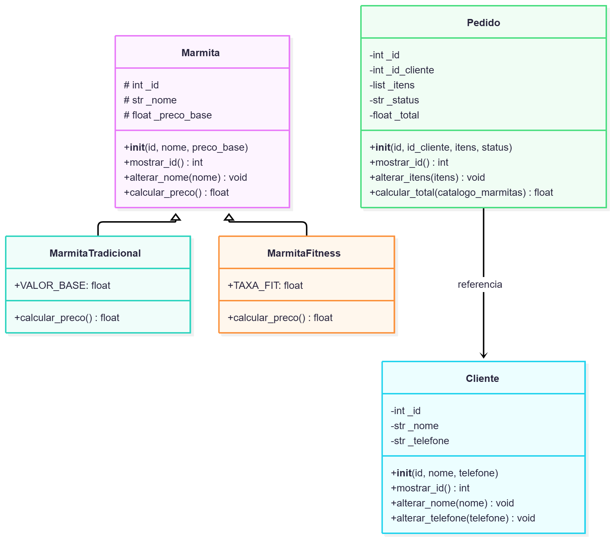

# MARMITA DO DIA

Sistema de gestão de pedidos e catálogo de marmitas desenvolvido em FastAPI, estruturado sob os princípios de Orientação a Objetos, polimorfismo, encapsulamento e validações robustas de regras de negócio.

---

## DIAGRAMA DE CLASSES



## Estrutura do Projeto

O projeto segue uma arquitetura modularizada, separando as regras de domínio técnico das rotas da API:

```text
marmita_do_dia/
│
├── app/
│   ├── models/
│   │   ├── marmita.py          # Classe base e hierarquia (Tradicional e Fitness)
│   │   ├── cliente.py          # Modelo de clientes
│   │   └── pedido.py           # Modelo de pedidos e itens
│   ├── routes/
│   │   ├── marmita_routes.py   # Endpoints de marmitas e filtros
│   │   ├── cliente_routes.py   # Endpoints de clientes
│   │   └── pedido_routes.py    # Endpoints de pedidos e transações
│   └── data/                   # Ficheiros de dados simulados (mock)
│
├── main.py                     # Ponto de entrada da aplicação FastAPI
└── README.md                   # Documentação oficial do projeto
```

## Divisão de Responsabilidades

| Integrante | Responsabilidade |
|------------|------------------|
| **Marcos** | Controllers e mock (dados simulados) |
| **Leonardo** | Diagrama de classes e models |
| **Fernando** | Routes e `main.py` |

## Rotas da API

| Método | Endpoint | Descrição | Status (Sucesso) |
| :--- | :--- | :--- | :--- |
| `GET` | `/api/marmitas` | Lista todas as marmitas | `200 OK` |
| `GET` | `/api/marmitas/tamanho/{tamanho}` | Lista marmitas por tamanho | `200 OK` |
| `GET` | `/api/marmitas/{id}` | Busca marmita por ID | `200 OK` |
| `GET` | `/api/clientes` | Lista todos os clientes | `200 OK` |
| `GET` | `/api/clientes/{id}` | Busca cliente por ID | `200 OK` |
| `GET` | `/api/pedidos` | Lista todos os pedidos | `200 OK` |
| `GET` | `/api/pedidos/faturamento` | Relatório de faturamento total | `200 OK` |
| `GET` | `/api/pedidos/{id}` | Busca pedido por ID | `200 OK` |
| `POST` | `/api/pedidos` | Cadastra um novo pedido | `201 Created` |
